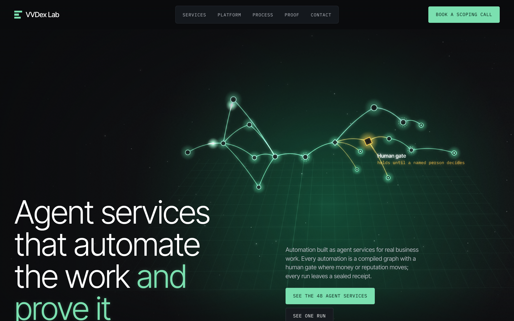
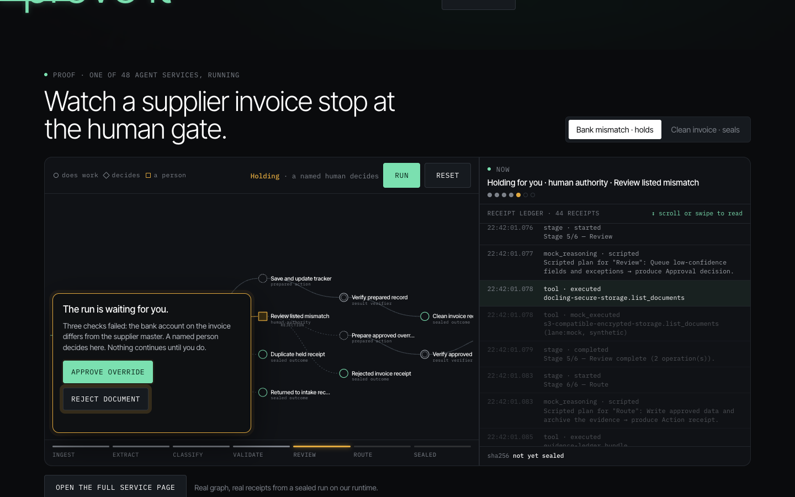
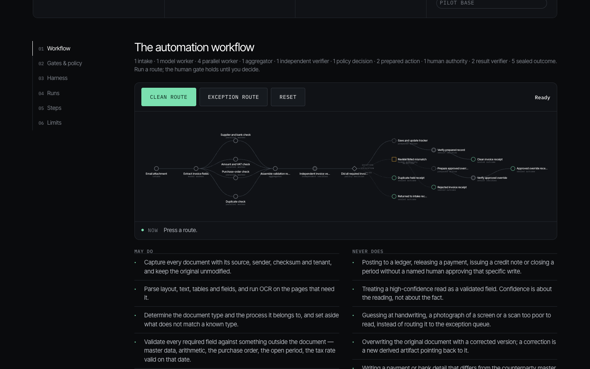
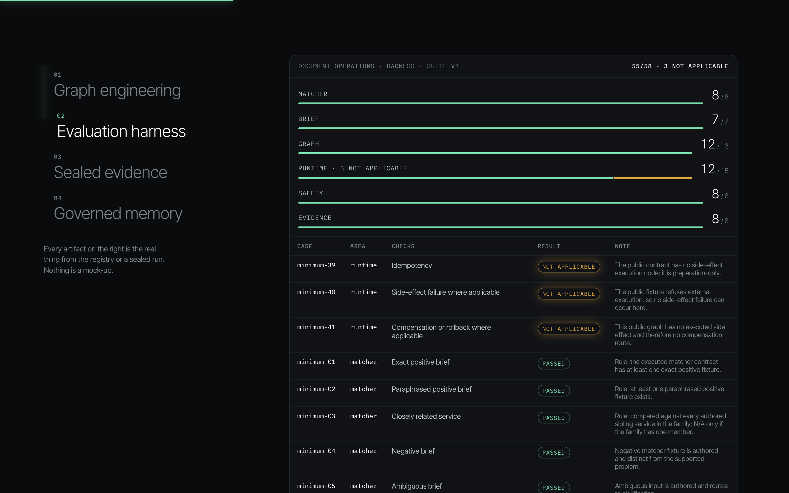
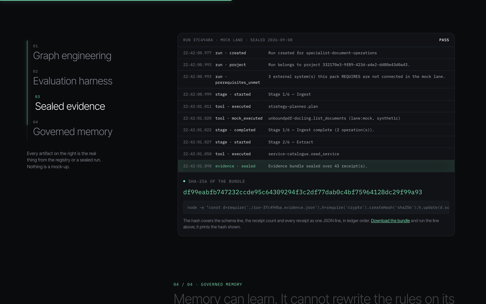
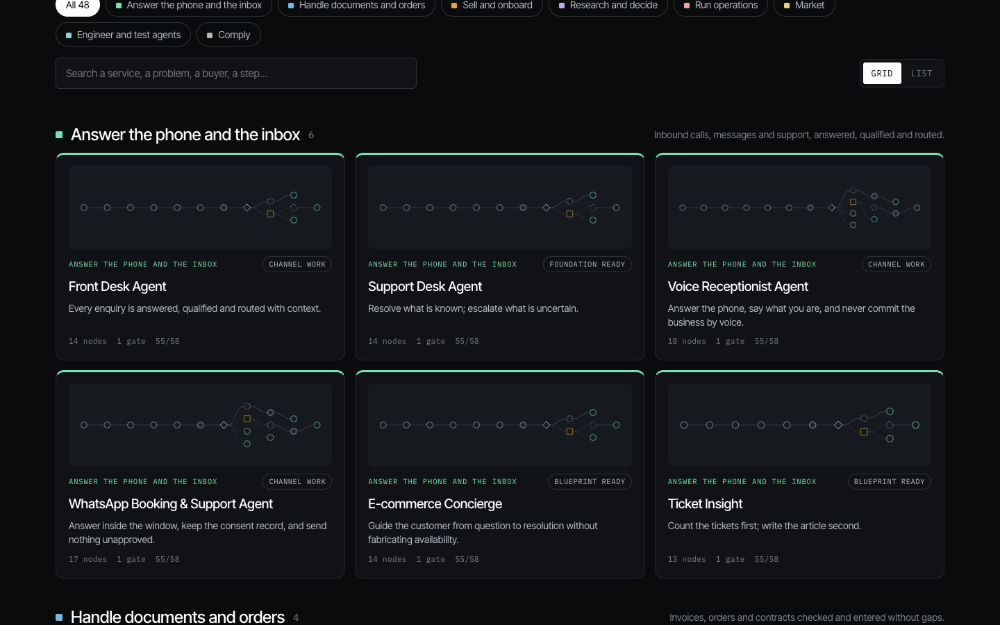

# Agent services as compiled graphs

[](https://github.com/vamsi-venkatesh/agent-services/actions/workflows/ci.yml)

Three production-shaped agent service packs from the VVDex Agent Service Lab, with the schema, a validator, a deterministic replay runner and a sealed evidence bundle you can hash yourself.

## The lab

The product is the VVDex Agent Service Lab at [lab.vvdexops.com/agent-services](https://lab.vvdexops.com/agent-services/), where 49 agent services are published. Each service is an executable graph rather than a description of one: typed nodes, branch-typed edges, and exactly one human gate, which only an exception reaches. A run moves through its stages in the open and ends in a sealed receipt that can be rehashed from the receipts alone. Across the catalogue, 2,842 evaluation cases are compiled from the service definitions and 0 of them fail.

This repository holds three of those services in full, so the shape can be read, validated and replayed without an account.



## What this is

A service here is a compiled graph, not a prompt and not a chain. Nodes are typed: intake, deterministic work, model reasoning, parallel workers, an aggregator, an independent verifier, a policy decision, prepared writes, the human gate, result verification and terminals. Edges carry a branch type. Each of the three graphs has exactly one human gate, and every node whose side effect is `authorized` sits behind it. Until a named person decides, a write is prepared and nothing leaves the run.

Each pack is measured by the same 58-case harness across six areas: matcher, brief, graph, runtime, safety and evidence. The harness executes the graph rather than reading it. It runs the clean path, the exception path, an approval and a rejection; it injects a worker failure, a timeout, a transient error, a cancellation and a duplicate start; it mutates the contract to remove the gate's approval edge and to turn a prepared write into an executed one, and requires the compiler to refuse both. `harness.json` in each pack carries the per-case result and the evidence line the case produced.

A run leaves receipts. The receipts are hashed into a bundle, and the bundle states the hash. `packs/document-operations/evidence/run-37c494ba.evidence.json` is one such bundle, 43 receipts from a real mock-lane run, and `tools/verify-bundle.mjs` recomputes its sha256 from the receipts alone.

The packs are complete operating documents. Thirteen files each: the overview, the design, the blueprint, the architecture diagram, the automation steps, the external services, the evaluation rules, the client intake questions, the customization checklist, the agent manifest, the toolkit, the runtime runbook and the project template. `pack.json` is the machine-readable definition behind them, in sixteen blocks, where a block that states nothing says so rather than being filled in by a renderer.



## The three packs

| Pack | What it automates | Nodes | Human gates | Harness | Not applicable |
| --- | --- | --- | --- | --- | --- |
| `document-operations` | Invoices and other documents from arrival to a validated record: extraction, four parallel checks, an independent verifier, and a prepared write that a person releases | 19 | 1 | 55 / 58 | 3 |
| `n8n-automation-rescue` | Diagnosing a workflow somebody else built: reproduce the failure, name the cause, prepare the smallest correction as a diff the owner imports | 11 | 1 | 55 / 58 | 3 |
| `mcp-integration` | Exposing one system through an MCP server: a written tool contract, conformance tests and safety probes, with every write-capable tool disabled at handover | 12 | 1 | 55 / 58 | 3 |

The three not-applicable cases are the same in each pack, and they are the ones about executed side effects: idempotency of an executed write, side-effect failure, and compensation or rollback. These graphs prepare writes and stop at the gate, so there is no executed external write for those cases to exercise. The harness records that as not applicable rather than as a pass.

## Quick start

Install nothing. Node 20 or newer, no dependencies.

```
git clone https://github.com/vamsi-venkatesh/agent-services.git
cd agent-services

# Recompute the sealed hash of the evidence bundle
node tools/verify-bundle.mjs packs/document-operations/evidence/run-37c494ba.evidence.json

# Validate all three packs against the schema and the structural rules
node tools/validate-pack.mjs

# Replay a graph: the clean path
node tools/run-mock.mjs packs/document-operations

# Replay the exception path and reject at the gate
node tools/run-mock.mjs packs/document-operations --route exception --decision reject

# Leave the decision out and the run holds at the gate
node tools/run-mock.mjs packs/mcp-integration --route exception
```

`run-mock.mjs` uses no model, no network and no credential. Identifiers and timestamps are derived from the pack id, the route and the decision, so the same command always prints the same sealed hash. Add `--out run.json` to write the bundle, then hash it with `verify-bundle.mjs`.



## Anatomy of a pack

| File | What it holds |
| --- | --- |
| `00-overview.md` | The purpose, the buyer, the operating mode and the readiness state |
| `01-design.md` | The job to be done and the operator's view of a run |
| `02-blueprint.yaml` | The service as data: channels, core systems, stages, decisions |
| `03-architecture.mmd` | The same shape as a Mermaid diagram |
| `04-automation.yaml` | The triggers and the ordered workflow steps with their outputs |
| `05-external-services.yaml` | Which capability each integration covers, and the selection rules |
| `06-evaluation.yaml` | The release gate, the metrics and the adversarial cases |
| `07-client-intake.md` | The questions asked before any tool is chosen |
| `08-customization-checklist.md` | What must be replaced before a client-specific version runs |
| `09-agent.manifest.yaml` | The specialist agent: mission, runtime, autonomy, boundaries |
| `10-toolkit.yaml` | Each tool with its category and its permission |
| `11-runtime-runbook.md` | How the agents are assembled and what is bound to what |
| `12-project-template.json` | The project base a client engagement is cloned from |
| `pack.json` | The definition: sixteen blocks of machine-readable semantics |
| `graph.json` | The compiled graph: typed nodes, branch-typed edges, one gate |
| `harness.json` | The 58-case result, per case and per area |
| `evidence/` | Sealed evidence bundles, where a run has produced one |

## Author your own

`schema/service-pack-definition.v1.schema.json` describes the sixteen blocks: identity, inputs, clarifications, workflow steps, decision gates, human gates, branching, actions, artifacts, metrics, receipts, agents, tools, public output, simulation fixture and readiness state. Every block carries a `missing` array. An empty array means the block is complete; a non-empty array names the field paths the block leaves unstated. There is no default and no fallback, so a surface can only draw what a pack actually said.

Put your definition at `packs/<your-pack>/pack.json` and your compiled graph at `packs/<your-pack>/graph.json`, then:

```
node tools/validate-pack.mjs packs/your-pack
```

The validator checks both files against their schemas and then the rules the schemas cannot express. `CONTRIBUTING.md` covers what a pull request needs.



## How the graph rules work

`schema/graph.v1.schema.json` defines twelve node types and six branch types. `tools/validate-pack.mjs` then enforces what a schema cannot:

- Exactly one node is a `human_gate`, and `humanGateCount` says so.
- The gate is left by exactly one `approval` edge and one `rejection` edge.
- No node whose side effect is `authorized` is reachable from the start when the gate is removed. A write that a person has not released cannot happen.
- Every node is reachable from the start node, every terminal is reachable, no terminal has an outgoing edge, and every other node has one.
- In the definition, an action that is consequential and not reversible names the human gate that authorizes it.
- Steps, receipts, counters, agent participation, paths and terminals all resolve to ids declared in the same pack.

Side effects are a three-state field. `none` writes nothing. `prepared` holds a write nobody has authorized. `authorized` is a write a person released at the gate. The replay runner counts them, and the mock lane's count of external sends is zero by construction.

## Evidence



The bundle schema is `vvdex.evidence-bundle/v1`. Its `sha256` is taken over the canonical receipt lines in ledger order:

```
sha256( schema + "\n" + receipts.length + "\n" + for each receipt: JSON.stringify(receipt) + "\n" )
```

Nothing else enters the hash: not the bundle's own header, not the seal time, not the totals. Hashing the receipts alone is what lets a later seal record a longer prefix of the same append-only trail.

`packs/document-operations/evidence/run-37c494ba.evidence.json` states `df99eabfb747232ccde95c64309294f3c2df77dab0c4bf75964128dc29f99a93` over 43 receipts. `node tools/verify-bundle.mjs` recomputes it and exits non-zero on a mismatch.

## Client projects

### FarmQuick

[farmquick.in](https://farmquick.in) is a B2B fresh-produce business in Bengaluru, selling vegetables to restaurants, hotels, caterers, retailers, processors and institutions. It is the first engagement, and it was delivered end to end: the website the business sells through, and the automation that finds it buyers.

**The web app.** A mobile-first ordering site on Cloudflare. It carries the catalogue, takes bulk enquiries, and writes every order into one central store. A self-hosted n8n workflow validates each order and sends the acknowledgement. Nothing is promised automatically: a person confirms every order. An order placed on the site is stored, acknowledged to the buyer, sent to the owner, written into the Lead Desk register as a won lead, and counted in the weekly report by buyer, product and city, with a copy in the business's Google Sheet.

**The automation.** Lead Desk, the lab's service, running in production. Seven open sources are read every morning across five cities - Bengaluru, Chennai, Mumbai, Delhi and Hyderabad. Every lead is scored by written rules, and a model is asked only where the rules cannot answer, under a daily cap, through a cache, with a receipt for each call. Market prices for the 42 catalogue items come from the public mandi price API. The morning digest is delivered over the company's own WhatsApp business number and its mailbox; the owner's one-word replies come back and update the register. Every run is hash-sealed.

What has been measured, on 12, 13 and 14 September 2026:

- 1,175 leads registered from seven sources in the first two days.
- 119 of those buyers carry a working phone number.
- Five digests delivered and read on 12 September.
- 64 model calls on the five-city day, all under the daily cap, none in error.
- The executable harness runs 119 cases: 117 pass and 2 fail. The two failures are kept as failures.
- The engine carries 394 tests.
- The order loop was proven end to end on 14 September 2026 with two test orders: site, store, workflow, register, owner alert.

Two things it has not done. No open posted requirement with a contact on it has been found yet, and no order has been won through it. Both would be stated here on the day they happen.

- Service page: [Lead Desk](https://lab.vvdexops.com/agent-services/services/lead-desk.html)
- Source: [github.com/vamsi-venkatesh/buyer-radar](https://github.com/vamsi-venkatesh/buyer-radar)

## Live



The three packs are three of the 49 services published at the Agent Service Lab:

- [lab.vvdexops.com/agent-services](https://lab.vvdexops.com/agent-services/)
- [Document Operations](https://lab.vvdexops.com/agent-services/document-operations/)
- [n8n Automation Rescue](https://lab.vvdexops.com/agent-services/n8n-automation-rescue/)
- [MCP Integration](https://lab.vvdexops.com/agent-services/mcp-integration/)

## Acknowledgements

Built by VVDex. Along the way we read the MCP server specifications, the n8n workflow format and the public tool-contract patterns of the agent ecosystem; the graphs, the gates, the harness and the runtime are ours.

## License

MIT. See `LICENSE`.
